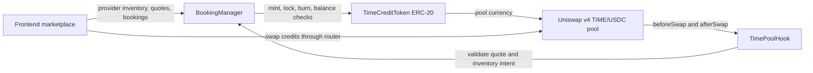
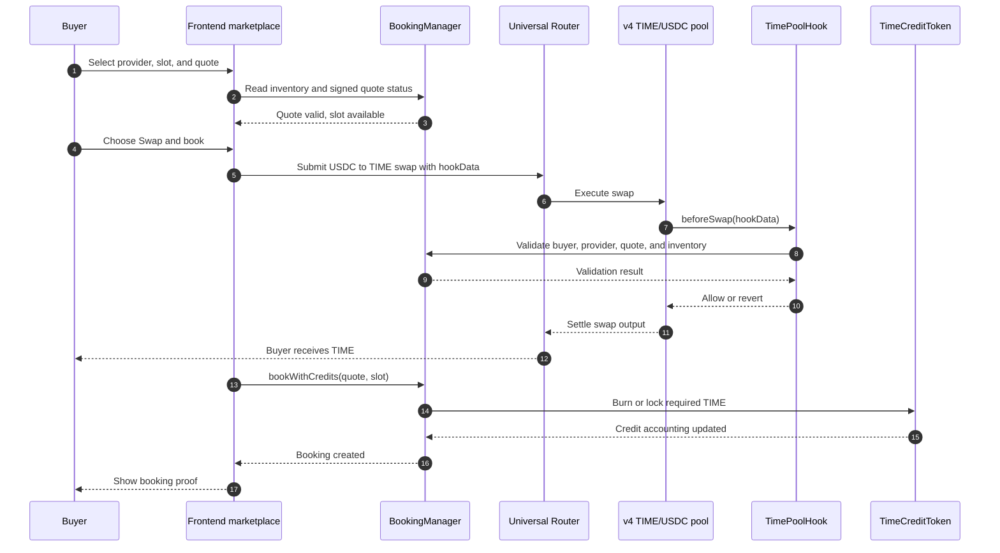
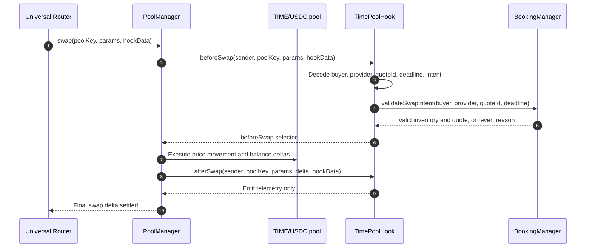
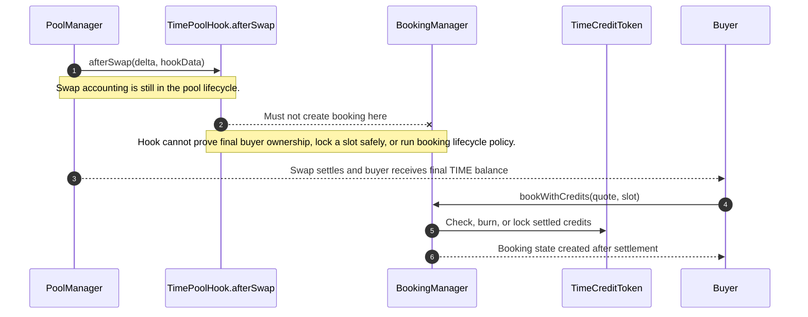

# Uniswap v4 Time Marketplace Architecture

## Purpose

This architecture refactors Time TokenAIzer into a first-party time-credit marketplace with Uniswap v4 as the liquidity layer. The marketplace is the frontend plus `BookingManager`. The v4 `TIME/USDC` pool lets buyers acquire or exit fungible credits, and `TimePoolHook` adds narrow trading-side checks. Booking, fulfillment, refunds, and disputes stay outside the hook.

## System Shape

Layer map: `Frontend marketplace -> BookingManager -> TimeCreditToken -> Uniswap v4 TIME/USDC pool -> TimePoolHook`.

## Component Responsibilities

`Frontend marketplace`

- Presents provider inventory, quotes, pool state, wallet readiness, and checkout modes.
- Requests signed booking quotes from the app or provider flow.
- Routes swaps through Uniswap v4 when the buyer needs `TIME`.
- Calls `BookingManager` for actual booking settlement after credits are available.

`BookingManager`

- Owns provider registration, inventory, quote validation, slot locking, booking lifecycle, cancellation, refund, completion, and dispute state.
- Checks signed quote terms and quote expiry.
- Burns or locks `TIME` credits when a booking is created.
- Is the marketplace source of truth.

`TimeCreditToken`

- ERC-20 credit token where 1e18 units represent 1 hour.
- Supports minting or allocation up to redeemable provider capacity.
- Supports burn or lock flows required by `BookingManager`.

`Uniswap v4 TIME/USDC pool`

- Provides liquidity and price discovery for `TIME` credits.
- Executes swaps through PoolManager and router flows.
- Does not reserve slots or create booking state.

`TimePoolHook`

- Uses `beforeSwap` to validate swap intent when `hookData` claims a booking-related purchase.
- Uses `afterSwap` for lightweight telemetry after pool execution.
- Does not book, transfer service rights, charge creator fees, or finalize marketplace settlement.

## Credits Purchase Then Booking

## Swap Plus Hook Inventory Check

## Why Booking Settlement Is Not Inside AfterSwap

Booking settlement needs final `TIME` ownership, slot locking, quote validation, replay protection, cancellation policy, and dispute state. Uniswap v4 uses flash accounting during pool operations, so hook callbacks should not assume intermediate deltas equal final user balances. Keeping settlement in `BookingManager` preserves a clear marketplace invariant: a booking exists only after the buyer has settled credits and called the marketplace contract.

## Security Notes

- The hook does not book. `TimePoolHook` must never call a booking creation path, reserve a slot, burn credits, or transfer service rights.
- `hookData` buyer must be validated. The hook must not trust arbitrary encoded buyer addresses without checking the expected router provenance, swap sender, quote subject, and intended recipient semantics.
- Signed quote validity is checked through `BookingManager`. The hook should delegate quote, provider, inventory, expiry, and replay checks to the marketplace contract instead of duplicating mutable marketplace state.
- Hook permissions are `beforeSwap` and `afterSwap` only. Address mining and deployment must encode only those permission flags.
- `afterSwap` is telemetry only in the MVP. It may emit swap intent or inventory pressure events, but it must not mutate booking lifecycle state.
- Creator and platform fee logic is deferred. Fees, dynamic fees, and creator revenue splits should wait until invariant tests cover booking accounting, swap execution, refunds, and disputes.
- AMM price is not a guaranteed booking price. The UI and contracts must keep fixed quote terms separate from pool execution price and slippage.
- Inventory cannot be oversold. Provider capacity, credit minting or allocation, and booking redemption must remain bounded by `BookingManager` inventory rules.

## Primary Testnet

Base Sepolia is the primary v4 integration network because official Uniswap v4 deployments exist there. Avalanche Fuji remains legacy KYC and Chainlink Functions demo support until equivalent v4 infrastructure is explicitly deployed.
